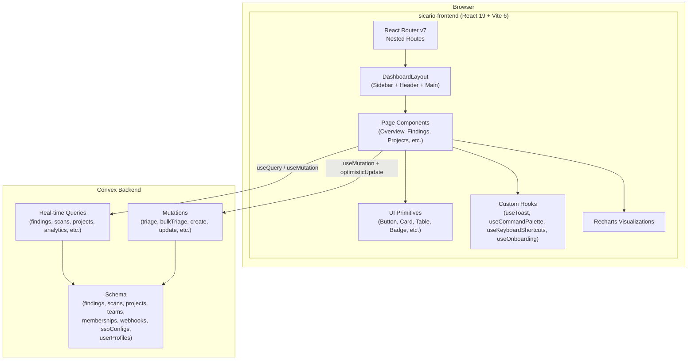
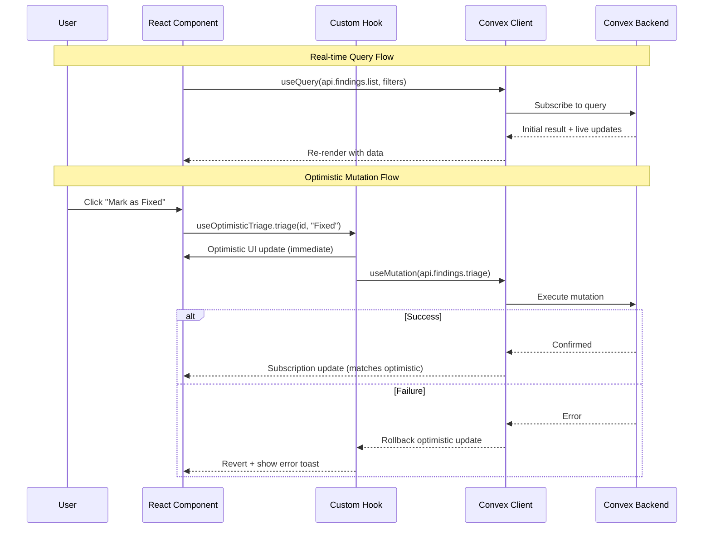

# Design Document: Dashboard Overhaul

## Overview

This design transforms the monolithic `sicario-frontend/src/pages/Dashboard.tsx` into a modular, multi-view security dashboard built on the existing React 19 + Vite 6 + Tailwind CSS v4 stack. The current Dashboard is a single ~600-line file with local mock data, client-side view switching via `useState`, and no backend integration. The overhaul replaces this with a proper route-based architecture using React Router DOM v7 nested routes, real-time Convex subscriptions for all data, and a comprehensive component library built on the existing design system tokens.

The key architectural decisions are:

1. **Nested routing over client-side view switching** — Replace the `currentView` state pattern with React Router nested routes under `/dashboard/*`, enabling URL-shareable views, browser back/forward navigation, and code splitting per page.

2. **Convex real-time subscriptions over REST polling** — Use `useQuery` and `useMutation` from the `convex/react` package for all data fetching, giving automatic real-time updates across all connected clients without manual refetch logic.

3. **Composition over monolith** — Break the single Dashboard.tsx into a layout shell + page components + shared primitives, with each page in its own file under `sicario-frontend/src/pages/dashboard/`.

4. **Optimistic updates with rollback** — Use Convex's `optimisticUpdate` option on mutations to reflect changes instantly, with automatic rollback on server error.

5. **Onboarding as a gated flow** — The onboarding wizard is a separate route (`/dashboard/onboarding`) that gates access to the main dashboard until completed, with all data persisted to Convex (not localStorage).

## Architecture

### High-Level Architecture



### Routing Structure

```
/dashboard
  /                     → Overview (redirects to /onboarding if not completed)
  /onboarding           → Onboarding wizard (multi-step)
  /findings             → Findings list with filters
  /findings/:id         → Finding detail
  /projects             → Projects grid
  /projects/:id         → Project detail
  /scans                → Scan history
  /scans/:id            → Scan detail
  /owasp                → OWASP compliance
  /analytics            → Analytics/trends
  /settings             → Settings (members, SSO, webhooks, preferences)
  *                     → 404 page
```

### File Structure

```
sicario-frontend/src/
├── pages/
│   └── dashboard/
│       ├── DashboardLayout.tsx        # Shell: sidebar + header + <Outlet/>
│       ├── OverviewPage.tsx
│       ├── FindingsPage.tsx
│       ├── FindingDetailPage.tsx
│       ├── ProjectsPage.tsx
│       ├── ProjectDetailPage.tsx
│       ├── ScansPage.tsx
│       ├── ScanDetailPage.tsx
│       ├── OwaspPage.tsx
│       ├── AnalyticsPage.tsx
│       ├── SettingsPage.tsx
│       ├── OnboardingPage.tsx
│       └── NotFoundPage.tsx
├── components/
│   ├── ui/                            # Design system primitives
│   │   ├── Button.tsx
│   │   ├── Input.tsx
│   │   ├── Select.tsx
│   │   ├── Checkbox.tsx
│   │   ├── Badge.tsx
│   │   ├── Card.tsx
│   │   ├── Table.tsx
│   │   ├── Modal.tsx
│   │   ├── Dropdown.tsx
│   │   ├── Tabs.tsx
│   │   ├── Tooltip.tsx
│   │   ├── Skeleton.tsx
│   │   └── Toast.tsx
│   ├── dashboard/                     # Dashboard-specific composites
│   │   ├── Sidebar.tsx
│   │   ├── Header.tsx
│   │   ├── CommandPalette.tsx
│   │   ├── StatCard.tsx
│   │   ├── SeverityBadge.tsx
│   │   ├── TriageForm.tsx
│   │   ├── FindingsTable.tsx
│   │   ├── BulkActionToolbar.tsx
│   │   ├── FilterBar.tsx
│   │   ├── EmptyState.tsx
│   │   ├── ErrorBoundary.tsx
│   │   ├── PdfExport.tsx
│   │   ├── KeyboardShortcutsOverlay.tsx
│   │   └── OnboardingWizard.tsx
│   └── charts/
│       ├── FindingsTrendChart.tsx
│       ├── SeverityDonutChart.tsx
│       ├── MttrBarChart.tsx
│       ├── ScanTimelineChart.tsx
│       └── LanguageBreakdownChart.tsx
├── hooks/
│   ├── useToast.ts
│   ├── useCommandPalette.ts
│   ├── useKeyboardShortcuts.ts
│   ├── useOnboarding.ts
│   ├── useOptimisticTriage.ts
│   ├── useFilters.ts
│   ├── usePdfExport.ts
│   └── useRbac.ts
├── lib/
│   ├── convex.ts                      # ConvexProvider setup
│   ├── pdf.ts                         # PDF generation utilities
│   ├── severity.ts                    # Severity color/order helpers
│   └── owasp.ts                       # OWASP category mapping
└── types/
    └── dashboard.ts                   # Shared TypeScript types
```

### Data Flow



## Components and Interfaces

### UI Primitives

All primitives use the combined token system from `index.css` and `design-tokens.css`. Each accepts a `className` prop for composition.

| Component | Props | Description |
|-----------|-------|-------------|
| `Button` | `variant: 'primary' \| 'secondary' \| 'ghost' \| 'destructive'`, `size: 'sm' \| 'md' \| 'lg'`, `loading: boolean`, `disabled: boolean` | Styled button with focus ring, loading spinner |
| `Input` | `type`, `placeholder`, `error: string`, `icon: ReactNode` | Text input with error state, optional leading icon |
| `Select` | `options: {value, label}[]`, `multiple: boolean`, `placeholder` | Dropdown select with multi-select support |
| `Checkbox` | `checked`, `indeterminate`, `onChange`, `label` | Checkbox with indeterminate state for select-all |
| `Badge` | `variant: 'severity' \| 'state' \| 'default'`, `color` | Colored label badge |
| `Card` | `padding`, `hover: boolean`, `onClick` | Container card with optional hover border effect |
| `Table` | `columns: ColumnDef[]`, `data`, `sortable`, `selectable`, `onSort`, `onSelect` | Data table with sorting, selection, pagination |
| `Modal` | `open`, `onClose`, `title`, `size` | Dialog with focus trap, Escape to close |
| `Dropdown` | `trigger: ReactNode`, `items: MenuItem[]` | Dropdown menu with keyboard navigation |
| `Tabs` | `tabs: {id, label}[]`, `activeTab`, `onChange` | Tab navigation |
| `Tooltip` | `content`, `side`, `children` | Hover tooltip |
| `Skeleton` | `variant: 'text' \| 'card' \| 'chart' \| 'table-row' \| 'circle'`, `width`, `height` | Shimmer loading placeholder |
| `Toast` | (managed by `useToast` hook) | Stacking toast notifications |

### Dashboard Composite Components

| Component | Responsibility |
|-----------|---------------|
| `Sidebar` | Collapsible navigation with icon-only mode below 768px, nav groups (Main, Reports, System), active route highlighting, user avatar footer |
| `Header` | Breadcrumb trail, global search trigger (opens CommandPalette), theme toggle, user avatar dropdown |
| `CommandPalette` | Cmd/Ctrl+K overlay with fuzzy search across navigation targets + finding IDs from Convex, keyboard arrow/Enter navigation |
| `StatCard` | Animated counter card with icon, label, value, optional severity badge, click-to-navigate |
| `SeverityBadge` | Color-coded severity indicator (Critical=red, High=amber, Medium=yellow, Low=blue, Info=gray) |
| `TriageForm` | Inline form: state selector, assignee autocomplete, notes textarea, save with optimistic update |
| `FindingsTable` | Sortable, paginated table with column definitions, row selection checkboxes, bulk action toolbar integration |
| `BulkActionToolbar` | Floating toolbar when rows selected: set triage state, assign, export selected |
| `FilterBar` | Multi-select severity, triage state, confidence slider, reachability toggle, text search — syncs to URL params |
| `EmptyState` | Contextual empty state with illustration, message, and CTA |
| `ErrorBoundary` | React error boundary with friendly error message and retry button |
| `PdfExport` | Generates branded PDF using client-side PDF library (jsPDF + html2canvas) with Sicario logo, timestamps, page numbers |
| `KeyboardShortcutsOverlay` | Modal showing all keyboard shortcuts, triggered by `?` key |
| `OnboardingWizard` | Multi-step wizard with animated transitions, progress indicator, back/next navigation, skip option |

### Custom Hooks

| Hook | Interface | Description |
|------|-----------|-------------|
| `useToast` | `toast({ variant, title, message, duration? })`, `dismiss(id)` | Toast notification manager with auto-dismiss and stacking |
| `useCommandPalette` | `{ isOpen, open, close, search, results }` | Command palette state and search logic |
| `useKeyboardShortcuts` | `(shortcuts: ShortcutDef[]) => void` | Registers global keyboard shortcuts, ignores when in input fields |
| `useOnboarding` | `{ status, selections, saveStep, complete, skip }` | Onboarding state from Convex, mutation helpers |
| `useOptimisticTriage` | `{ triage(id, state), bulkTriage(ids, state) }` | Wraps Convex mutations with optimistic updates and rollback |
| `useFilters` | `{ filters, setFilter, clearFilters, urlParams }` | Filter state synced to URL search params |
| `usePdfExport` | `{ exportPdf(elementRef, title) }` | PDF generation from DOM element |
| `useRbac` | `{ role, canManageProjects, canManageMembers, canConfigureSSO, canManageWebhooks }` | Current user's RBAC permissions from Convex membership |

### Key Interfaces (TypeScript)

```typescript
// Severity levels used throughout the dashboard
type Severity = 'Critical' | 'High' | 'Medium' | 'Low' | 'Info';

// Triage workflow states
type TriageState = 'Open' | 'Reviewing' | 'ToFix' | 'Fixed' | 'Ignored' | 'AutoIgnored';

// Finding as returned by Convex queries (mapped shape)
interface Finding {
  id: string;
  scan_id: string;
  rule_id: string;
  rule_name: string;
  file_path: string;
  line: number;
  column: number;
  end_line: number | null;
  end_column: number | null;
  snippet: string;
  severity: Severity;
  confidence_score: number;
  reachable: boolean;
  cloud_exposed: boolean | null;
  cwe_id: string | null;
  owasp_category: string | null;
  fingerprint: string;
  triage_state: TriageState;
  triage_note: string | null;
  assigned_to: string | null;
  created_at: string;
  updated_at: string;
}

// Filter parameters for findings queries
interface FindingFilters {
  severity?: Severity[];
  triageState?: TriageState[];
  confidenceMin?: number;
  confidenceMax?: number;
  reachable?: boolean;
  search?: string;
  scanId?: string;
  owaspCategory?: string;
  page?: number;
  perPage?: number;
}

// Onboarding data persisted to Convex
interface OnboardingProfile {
  onboardingCompleted: boolean;
  onboardingCompletedAt: string | null;
  onboardingSkipped: boolean;
  role: string | null;
  teamSize: string | null;
  languages: string[];
  cicdPlatform: string | null;
  goals: string[];
}

// Toast notification
interface ToastMessage {
  id: string;
  variant: 'success' | 'error' | 'warning' | 'info';
  title: string;
  message?: string;
  duration?: number;
}

// Command palette command
interface PaletteCommand {
  id: string;
  label: string;
  category: 'navigation' | 'action';
  icon?: React.ReactNode;
  shortcut?: string;
  action: () => void;
}

// Keyboard shortcut definition
interface ShortcutDef {
  keys: string[];  // e.g. ['g', 'f'] for "G then F"
  action: () => void;
  description: string;
  scope?: 'global';
}
```

## Data Models

### Existing Convex Schema (no changes needed)

The existing schema in `convex/convex/schema.ts` already covers the core domain:

- **findings** — Security findings with severity, confidence, reachability, CWE/OWASP, triage state, fingerprint
- **scans** — Scan metadata with repository, branch, commit, duration, language breakdown
- **projects** — Registered repositories with team assignment
- **teams** — Organizational teams within an org
- **memberships** — User-org-role mappings with team assignments
- **webhooks** / **webhookDeliveries** — Webhook configurations and delivery logs
- **ssoConfigs** — SSO provider configurations per org
- **organizations** — Top-level org records

### New Table: `userProfiles` (for onboarding)

A new table is required to store onboarding data and personalization preferences:

```typescript
// Addition to convex/convex/schema.ts
userProfiles: defineTable({
  userId: v.string(),
  onboardingCompleted: v.boolean(),
  onboardingCompletedAt: v.optional(v.string()),
  onboardingSkipped: v.boolean(),
  role: v.optional(v.string()),
  teamSize: v.optional(v.string()),
  languages: v.array(v.string()),
  cicdPlatform: v.optional(v.string()),
  goals: v.array(v.string()),
  createdAt: v.string(),
  updatedAt: v.string(),
}).index("by_userId", ["userId"]),
```

### New Convex Functions Required

| Module | Function | Type | Purpose |
|--------|----------|------|---------|
| `userProfiles.ts` | `get` | query | Get current user's profile (onboarding status + preferences) |
| `userProfiles.ts` | `upsert` | mutation | Create or update user profile with onboarding selections |
| `userProfiles.ts` | `completeOnboarding` | mutation | Mark onboarding as completed with timestamp |
| `userProfiles.ts` | `skipOnboarding` | mutation | Mark onboarding as skipped |
| `analytics.ts` | `topVulnerableProjects` | query | Projects ranked by open finding count |
| `analytics.ts` | `owaspCompliance` | query | Findings grouped by OWASP category with compliance scores |
| `analytics.ts` | `findingsByLanguage` | query | Findings grouped by language (from scan language breakdown) |
| `findings.ts` | `listAdvanced` | query | Enhanced list with multi-value severity/state filters, text search, server-side sort |
| `findings.ts` | `getTimeline` | query | Triage state change history for a finding (derived from updatedAt changes) |
| `findings.ts` | `getAdjacentIds` | query | Previous/next finding IDs given current filters and current finding ID |

### Convex Provider Integration

The frontend needs the Convex React client configured:

```typescript
// sicario-frontend/src/lib/convex.ts
import { ConvexProvider, ConvexReactClient } from "convex/react";

const convex = new ConvexReactClient(import.meta.env.VITE_CONVEX_URL);
```

New dependencies to add to `sicario-frontend/package.json`:
- `convex` — Convex client SDK
- `recharts` — Already implied by requirements, needs explicit addition
- `jspdf` + `html2canvas` — PDF generation
- `cmdk` — Command palette component (or build from scratch)

