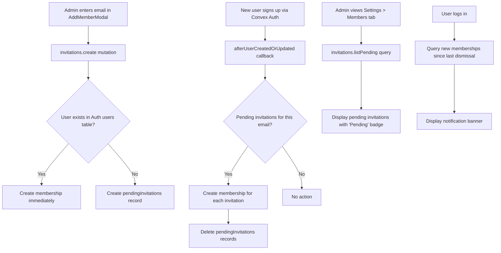

# Design Document: Email-Based Member Invite

## Overview

This design replaces the current User ID-based member addition flow with an email-based invite system. The core change introduces a two-path resolution: when an admin enters an email address, the backend looks up the Convex Auth `users` table. If a matching user exists, a membership is created immediately. If not, a `pendingInvitations` record is stored and automatically converted to a membership when the invitee signs up.

The system spans three layers:
1. A new `pendingInvitations` Convex table with associated mutations/queries
2. A Convex Auth `afterUserCreatedOrUpdated` callback that processes pending invitations on signup
3. A redesigned `AddMemberModal` React component and a new notification banner

Key design decision: rather than sending actual emails (which would require an email service integration), the system relies on the invitee eventually signing up with the same email address. The "invite" is a stored intent, not a delivered message.

## Architecture



## Components and Interfaces

### Backend (Convex Functions)

#### `convex/invitations.ts` — New file

| Function | Type | Args | Returns | Description |
|----------|------|------|---------|-------------|
| `create` | mutation | `callerUserId, orgId, email, role, teamIds?` | `{ status: "added" \| "invited", email }` | Resolves email → user. Creates membership or pending invitation. |
| `listPending` | query | `orgId, callerUserId` | `PendingInvitation[]` | Lists all pending invitations for an org. Admin only. |
| `revoke` | mutation | `callerUserId, orgId, invitationId` | `boolean` | Deletes a pending invitation. Admin only. |
| `getNewMemberships` | query | `userId` | `NewMembership[]` | Returns memberships created after the user's last dismissal timestamp. |
| `dismissNotifications` | mutation | `userId` | `void` | Records the current timestamp as the user's last notification dismissal. |

#### `convex/auth.ts` — Modified

Add `afterUserCreatedOrUpdated` callback to the `convexAuth` config. On each sign-in/signup, query `pendingInvitations` by the user's email. For each match, create a membership and delete the invitation.

#### `convex/rbac.ts` — No changes

The existing `requireRole` helper is reused for all invitation operations.

### Frontend (React Components)

#### `AddMemberModal` — Modified in `SettingsPage.tsx`

- Replace `userId: string` field with `email: string` field
- Add email format validation (regex + trim)
- Call `api.invitations.create` instead of `api.memberships.create`
- Display differentiated success messages ("Member added" vs "Invitation sent")

#### `MembersTab` — Modified in `SettingsPage.tsx`

- Query `api.invitations.listPending` alongside `api.memberships.list`
- Render pending invitations in the same table with a "Pending" `Badge` and a "Revoke" action button

#### `NewMembershipBanner` — New component

- Rendered at the top of the dashboard layout
- Queries `api.invitations.getNewMemberships`
- Shows org name(s) and role(s) for new memberships
- Dismissible; calls `api.invitations.dismissNotifications` on dismiss

## Data Models

### New Table: `pendingInvitations`

```typescript
pendingInvitations: defineTable({
  invitationId: v.string(),   // crypto.randomUUID()
  email: v.string(),           // normalized to lowercase
  orgId: v.string(),
  role: v.string(),            // "admin" | "manager" | "developer"
  teamIds: v.array(v.string()),
  inviterUserId: v.string(),   // the admin who created the invitation
  createdAt: v.string(),       // ISO 8601
})
  .index("by_orgId", ["orgId"])
  .index("by_email", ["email"])
  .index("by_orgId_email", ["orgId", "email"])
```

### Modified Table: `userProfiles`

Add an optional field to track notification dismissal:

```typescript
lastNotificationDismissedAt: v.optional(v.string())  // ISO 8601
```

### Email Normalization

All email addresses are normalized to lowercase before storage and lookup. This ensures `User@Example.com` and `user@example.com` match correctly.

### User Lookup Strategy

The `invitations.create` mutation resolves an email to a user by scanning the Convex Auth `users` table for a record where `email` matches (case-insensitive via lowercase normalization). Since the Auth `users` table does not have an email index, the lookup uses `ctx.db.query("users").collect()` filtered in JS. This is acceptable because the users table is bounded in size for a B2B SaaS product.

If a match is found, the user's `_id` (as string) is used as the `userId` for the membership record — consistent with how `ensureOrg` and `organizations.ts` derive `userId` from `tokenIdentifier.split("|").pop()`.


## Correctness Properties

*A property is a characteristic or behavior that should hold true across all valid executions of a system — essentially, a formal statement about what the system should do. Properties serve as the bridge between human-readable specifications and machine-verifiable correctness guarantees.*

### Property 1: Email lookup finds correct user by normalized email

*For any* email address and any set of users in the Auth users table, looking up the email (after lowercase normalization) should return the user whose stored email matches the normalized input, or null if no match exists.

**Validates: Requirements 1.1**

### Property 2: Email validation accepts valid emails and rejects invalid ones

*For any* string, the email validation function should accept strings matching the `local-part@domain` format (after trimming whitespace) and reject all others. Additionally, *for any* valid email with arbitrary leading/trailing whitespace, trimming then validating should produce the same result as validating the email without whitespace.

**Validates: Requirements 2.1, 2.3**

### Property 3: Immediate membership creation preserves invite fields

*For any* valid (email, orgId, role, teamIds) tuple where the email matches an existing user who is not already a member, the invite mutation should create a membership record with the matched user's ID, the specified orgId, role, and teamIds.

**Validates: Requirements 1.2**

### Property 4: Pending invitation stores all required fields

*For any* valid (email, orgId, role, teamIds, inviterUserId) tuple where no user matches the email, the invite mutation should create a pendingInvitations record containing: a unique invitationId, the normalized email, orgId, role, teamIds, inviterUserId, and a createdAt timestamp.

**Validates: Requirements 1.3, 6.1**

### Property 5: Duplicate membership rejection

*For any* email address that resolves to a user who already has a membership in the target organization, the invite mutation should return an error indicating the user is already a member, and no new records should be created.

**Validates: Requirements 1.5**

### Property 6: Duplicate pending invitation rejection

*For any* (email, orgId) pair where a pending invitation already exists for that email in that organization, the invite mutation should return an error indicating an invitation is already pending, and no new records should be created.

**Validates: Requirements 1.6, 6.4**

### Property 7: Pending invitation to membership round-trip

*For any* set of pending invitations matching a new user's email, after the signup acceptance process runs, there should be exactly one new membership per invitation with the role and teamIds from the invitation, and all matching pending invitation records should be deleted.

**Validates: Requirements 3.1, 3.2, 3.3**

### Property 8: RBAC enforcement for invitation operations

*For any* user and organization, the invite create and revoke mutations should succeed if and only if the user has the "admin" role in that organization. Non-admin users (manager, developer, or non-members) should receive an "Access denied" error.

**Validates: Requirements 5.1, 5.2, 5.3**

### Property 9: Pending invitation listing returns complete records

*For any* organization with pending invitations, the listPending query (called by an admin) should return all pending invitations for that org, and each returned record should include email, role, teamIds, and createdAt.

**Validates: Requirements 4.1, 4.2**

### Property 10: Pending invitation revocation deletes the record

*For any* pending invitation, after an admin revokes it, the invitation should no longer appear in the listPending results for that organization.

**Validates: Requirements 4.3**

### Property 11: New membership notification returns all recent memberships

*For any* user with memberships created after their last notification dismissal timestamp, the getNewMemberships query should return all such memberships, and each result should include the organization name and the assigned role.

**Validates: Requirements 8.1, 8.2, 8.4**

### Property 12: Notification dismissal prevents re-showing

*For any* user who dismisses the notification banner, a subsequent call to getNewMemberships should return no results for memberships that existed before the dismissal, until new memberships are created after the dismissal timestamp.

**Validates: Requirements 8.3**

## Error Handling

| Scenario | Error Message | Behavior |
|----------|--------------|----------|
| Non-admin calls `invitations.create` | "Access denied: requires 'admin' role" | Mutation throws, no records created |
| Non-admin calls `invitations.revoke` | "Access denied: requires 'admin' role" | Mutation throws, no records deleted |
| Email already has membership in org | "User is already a member of this organization" | Mutation throws, no records created |
| Email already has pending invitation in org | "An invitation is already pending for this email" | Mutation throws, no records created |
| Invalid email format (frontend) | "Please enter a valid email address" | Inline validation error, form submission blocked |
| Empty email (frontend) | "Email address is required" | Inline validation error, form submission blocked |
| Membership creation fails during signup acceptance | Error logged, pending invitation retained | `afterUserCreatedOrUpdated` catches per-invitation errors, continues processing remaining invitations |
| Invitation for non-existent org | "Organization not found" | Mutation throws (defensive check) |

### Error Recovery in Signup Acceptance

The `afterUserCreatedOrUpdated` callback processes each pending invitation independently in a try/catch. If creating a membership for one invitation fails (e.g., race condition where user was already added), the callback:
1. Logs the error with the invitation details
2. Retains the pending invitation record (so it can be retried or manually resolved)
3. Continues processing remaining invitations

This ensures a single failure doesn't block other pending invitations from being accepted.

## Testing Strategy

### Property-Based Tests (fast-check + vitest)

The project already uses `fast-check` v4.1.1 with `vitest` for property-based testing. Since Convex mutations/queries require the Convex runtime, tests will follow the established pattern from the codebase: source code analysis combined with pure JS logic simulation.

Each property test must:
- Run a minimum of 100 iterations
- Reference its design document property in a comment tag
- Tag format: `Feature: email-based-member-invite, Property {number}: {property_text}`

Properties to implement as PBT:
- Property 1: Email lookup normalization
- Property 2: Email validation + trimming
- Property 3: Immediate membership field preservation
- Property 4: Pending invitation field completeness
- Property 5: Duplicate membership rejection
- Property 6: Duplicate pending invitation rejection
- Property 7: Pending invitation → membership round-trip
- Property 8: RBAC enforcement
- Property 9: Listing completeness
- Property 10: Revocation deletion
- Property 11: New membership notification query
- Property 12: Dismissal round-trip

### Unit Tests (example-based)

- AddMemberModal renders email input instead of User ID input (Req 7.1)
- AddMemberModal retains role dropdown and teams multi-select (Req 7.2, 7.3)
- AddMemberModal calls `api.invitations.create` on submit (Req 7.4)
- AddMemberModal shows loading state during submission (Req 7.5)
- Success toast differentiates "Member added" vs "Invitation sent" (Req 1.4)
- Pending invitations display with "Pending" badge in members table (Req 4.4)
- Notification banner renders at top of dashboard (Req 8.5)
- Specific invalid email examples: `"not-an-email"`, `"@domain.com"`, `"user@"`, `""` (Req 2.2)

### Integration Tests

- End-to-end flow: admin invites email → user signs up → membership auto-created
- Schema validation: `pendingInvitations` table has `by_orgId`, `by_email`, and `by_orgId_email` indexes (Req 6.2, 6.3)
