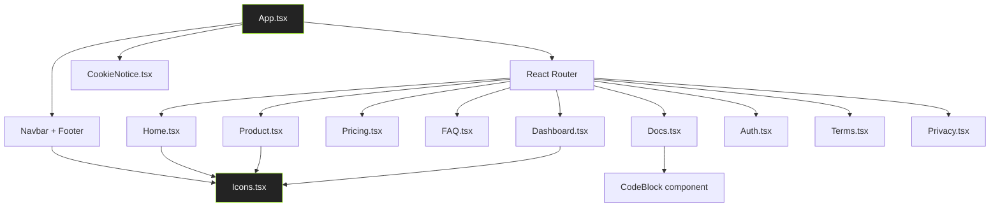

# Design Document: Sicario Frontend Overhaul

## Overview

This design covers the comprehensive content overhaul of the Sicario React + Vite + Tailwind CSS v4 frontend. The existing site is themed around a fictional "autonomous red-teaming swarm" with AI agents, but Sicario is actually a Rust-based SAST/SCA/Secret scanning CLI tool with AI remediation. Every page must be rewritten to reflect the real product while preserving the dark-theme design system (backgrounds, accent colors, fonts, noise textures, grid backgrounds, bento cards, shimmer effects, rotating conic borders, marquee animations, chromatic aberration).

The overhaul touches 11 page/component files plus the shared Icons component. No new routes, no new dependencies, no structural changes to the React Router setup or Tailwind/Vite configuration. This is a content-in-place replacement.

### Key Design Decisions

1. **Content-only replacement**: All component structures, layouts, CSS classes, and animation patterns are preserved. Only text content, icon references, data arrays, and testimonial copy change.
2. **Icons strategy**: Swarm-themed icons (Cartographer, Breacher, Critic, Ghost, Accountant, Admin, Scribe) are replaced/repurposed with security-tool icons (SAST, SCA, Secrets, Reachability, AI Fix, TUI, MCP, Reports). Generic utility icons and brand icons are retained.
3. **No new dependencies**: All new icons are hand-crafted SVGs in the existing `Icons.tsx` pattern. No new icon libraries.
4. **Terminology mapping**: A consistent terminology map drives all content changes across pages.

### Terminology Map

| Old Term | New Term |
|---|---|
| Swarm / Siege / Hit | Scan / Analysis |
| Shadow Tier | Community (Free) |
| Operator Tier | Team |
| State-Actor Tier | Enterprise |
| Mission Control | Dashboard / Overview |
| Perimeter Targets | Projects |
| Breach Reports | Findings |
| Remediation Vault | AI Fixes |
| Live Swarm Feed | Scan History |
| Vault Key / API Key auth | OAuth 2.0 + PKCE (`sicario login`) |
| Deploy a Siege | Get Started / Install CLI |
| Start Hunting | Get Started |
| Scribe Patches | AI Remediation |
| Nodes (Cartographer, Breacher, etc.) | Modules (SAST Engine, SCA Scanner, etc.) |
| npx sicario-red-team | sicario (Rust binary) |

### CLI-to-Cloud Workflow (Aligned with Semgrep)

The frontend must present Sicario's CLI-to-cloud connection using the same workflow pattern as [Semgrep](https://semgrep.dev/docs/cli-reference/). Semgrep's CLI uses `semgrep login` to open a browser for OAuth authentication, `semgrep scan` for local scans, `semgrep ci` for CI scans that send findings to the cloud, and `semgrep publish` for rule publishing. Sicario mirrors this pattern exactly:

| Semgrep Command | Sicario Equivalent | Purpose |
|---|---|---|
| `semgrep scan` | `sicario scan` | Local scan (no account required) |
| `semgrep ci` | `sicario scan . --publish` | CI scan that syncs findings to cloud |
| `semgrep login` | `sicario login` | Browser-based OAuth login (opens browser, user clicks Activate) |
| `semgrep logout` | `sicario logout` | Remove local credentials |
| `semgrep publish` | `sicario publish` | Publish custom rules to cloud |
| `semgrep test` | `sicario rules test` | Test custom rules |
| `semgrep validate` | `sicario rules validate` | Validate rule syntax |
| `semgrep lsp` | `sicario lsp` | Language Server Protocol for IDEs |
| `semgrep mcp` | `sicario mcp` | MCP server for AI assistants |

This alignment must be reflected in:
1. **Docs page**: Installation → `sicario login` (browser-based OAuth, not API key) → `sicario scan .` → view findings in cloud dashboard
2. **Dashboard onboarding**: "Run Your First Scan" flow must show: install CLI → `sicario login` (opens browser) → `sicario scan .` → findings appear in dashboard
3. **Auth page**: The web login page is what users see when `sicario login` opens their browser — it must clearly communicate this is the CLI authentication flow
4. **Pricing page**: Community tier works fully offline like `semgrep scan`; Team tier adds cloud sync like `semgrep ci` with AppSec Platform

### `sicario login` Flow (All Users)

When any user (free or paid) runs `sicario login` in their terminal:

1. **CLI prints**: "Opening browser for authentication..." with a fallback URL if the browser doesn't open
2. **Browser opens** to the Auth page (`/auth`) — this is the same page for both web login and CLI-initiated login
3. **User authenticates** via GitHub OAuth, SSO, or email/password (same form as current Auth.tsx)
4. **After successful auth**, the browser shows a success message: "CLI authenticated. You can close this tab."
5. **CLI receives** the OAuth token via the PKCE callback and stores it securely in the OS keyring
6. **CLI prints**: "Authenticated as [email]. You can now sync findings to Sicario Cloud."

For a **paid (Team/Enterprise) user**, after login:
- `sicario scan .` runs locally as normal
- `sicario scan . --publish` syncs findings to the cloud dashboard where they appear in the Findings view
- The dashboard shows full access to all views (Projects, Findings, AI Fixes, Scan History, OWASP Reports)
- Team members can see each other's scans and collaborate on findings

For a **free (Community) user**, after login:
- `sicario scan .` runs locally as normal (full CLI functionality)
- `sicario scan . --publish` is rejected with a message: "Cloud sync requires a Team plan. Run `sicario scan .` for local scanning, or upgrade at https://sicario.dev/pricing"
- The dashboard shows the limited view with upgrade prompts (as described in the Dashboard Access Model)

The Auth page does NOT need to differentiate between CLI-initiated and web-initiated logins — the same form handles both. The only difference is the post-auth redirect: CLI login shows "CLI authenticated, close this tab" while web login redirects to `/dashboard`.

### Dashboard Access Model by Tier

Free-tier (Community) users CAN create an account and log in via `sicario login`, but their dashboard experience is limited:

| Feature | Community (Free) | Team ($49/mo) | Enterprise |
|---|---|---|---|
| CLI scanning (local) | ✅ Full access | ✅ Full access | ✅ Full access |
| `sicario login` (create account) | ✅ | ✅ | ✅ |
| Dashboard access | ⚠️ Limited — sees overview + upgrade prompts | ✅ Full access | ✅ Full access |
| Cloud finding sync | ❌ Local only | ✅ Unlimited | ✅ Unlimited |
| Projects view | ❌ Upgrade prompt | ✅ | ✅ |
| Findings view | ❌ Upgrade prompt | ✅ | ✅ |
| AI Fixes view | ❌ Upgrade prompt | ✅ | ✅ |
| Scan History | ❌ Upgrade prompt | ✅ | ✅ |
| OWASP Reports | ❌ | ✅ | ✅ |
| Team collaboration | ❌ | ✅ | ✅ |
| Webhooks | ❌ | ✅ | ✅ |

When a Community-tier user navigates to the dashboard after logging in, they see:
1. The **Overview** page with the "Run Your First Scan" onboarding flow (always visible)
2. Sidebar navigation items for Projects, Findings, AI Fixes, and Scan History are visible but clicking them shows an **upgrade prompt** (reusing the existing upgrade modal pattern from the current Dashboard.tsx `handleRestrictedAction` flow)
3. The upgrade modal promotes Team tier features: cloud finding sync, team collaboration, OWASP reports, webhooks
4. This mirrors how the current Dashboard.tsx already gates "Live Swarm Feed" behind the Operator tier — the same `restricted` flag pattern is reused for Team-gated views

## Architecture

The frontend architecture remains unchanged. The application is a single-page React 19 app with client-side routing via React Router DOM v7, built with Vite 6, styled with Tailwind CSS v4 (using the `@tailwindcss/vite` plugin), and animated with Framer Motion (`motion` package).



### Routing Structure (Unchanged)

- `/` → Home (with Navbar + Footer)
- `/product` → Product (with Navbar + Footer)
- `/pricing` → Pricing (with Navbar + Footer)
- `/faq` → FAQ (with Navbar + Footer)
- `/docs` → Docs (standalone layout with sidebar)
- `/dashboard` → Dashboard (standalone layout, no Navbar/Footer)
- `/auth` → Auth (standalone layout, no Navbar/Footer)
- `/terms` → Terms (with Navbar + Footer)
- `/privacy` → Privacy (with Navbar + Footer)

### Design System (Preserved — index.css)

No changes to `index.css`. All CSS custom properties, animations, and effects are retained:

- `@theme` block with color/font tokens
- `body::before` noise texture overlay
- `.bg-grid` radial-masked grid
- `.active-border-*` rotating conic gradient border
- `.text-shimmer` animated gradient text
- `.chromatic-hover` chromatic aberration effect
- `.animate-marquee` / `.animate-marquee-reverse` marquee animations
- `::selection` accent color

## Components and Interfaces

### Icons.tsx — Icon Library

**Retained icons** (no changes):
- Utility: `IconMenu`, `IconX`, `IconChevronDown`, `IconPlus`, `IconSparkles`, `IconLink`, `IconCheck`, `IconShield`, `IconZap`, `IconTerminal`
- Social: `IconTwitter`, `IconGithub`, `IconDisc`, `IconYoutube`
- Brand: `IconReact`, `IconNextjs`, `IconNodejs`, `IconDocker`, `IconAws`, `IconFlutter`, `IconKotlin`, `IconSvelte`, `IconSupabase`, `IconVue`, `IconNuxt`, `IconPinecone`
- Other: `IconCookie`

**Removed/Replaced icons** (swarm-themed → security-tool-themed):

| Old Icon | New Icon | Purpose |
|---|---|---|
| `IconCartographer` | `IconSast` | SAST engine |
| `IconBreacher` | `IconSca` | SCA/dependency scanning |
| `IconCritic` | `IconSecrets` | Secret detection |
| `IconGhost` | `IconReachability` | Data-flow reachability |
| `IconAccountant` | `IconAiFix` | AI remediation |
| `IconAdmin` | `IconCloudSync` | Cloud dashboard/sync |
| `IconScribe` | `IconReport` | SARIF/OWASP reporting |

**New icons added**:
- `IconTui` — Interactive TUI dashboard
- `IconMcp` — MCP server for AI assistants
- `IconRust` — Rust language brand icon
- `IconGo` — Go language brand icon
- `IconJava` — Java language brand icon
- `IconPython` — Python language brand icon

All new icons follow the existing pattern: `({ className }: { className?: string }) => <svg .../>` with `viewBox="0 0 24 24"`, `fill="none"`, `stroke="currentColor"`, `strokeWidth="1.5"`, `strokeLinecap="square"`.

### App.tsx — Navbar + Footer + Routing

**Navbar changes**:
- Product dropdown: Replace "Core Swarm" / "Specialized Nodes" sections with "Analysis" (SAST, SCA, Secrets, Reachability) and "Tools" (AI Remediation, TUI Dashboard, MCP Server, SARIF Reports)
- CTA button: "Start Hunting" → "Get Started"
- Mobile CTA: "Deploy a Siege" → "Get Started"
- Icon imports updated to new icon names

**Footer changes**:
- Tagline: "The autonomous red-teaming swarm. Stop scanning. Start hunting." → "Next-generation SAST, SCA, and secret scanning. One binary. Zero compromise."
- Security badges: "Zero-Footprint Architecture" → "Single Binary, Zero Dependencies"; "Fully Local Execution" → "500+ Security Rules"
- "Read our architecture doc" link → "Read our documentation" linking to `/docs`
- GitHub link: Update URL to `https://github.com/EmmyCodes234/sicario-cli`
- NPM link: Replace with Homebrew or remove (Sicario is a Rust binary installed via Homebrew/curl, not npm)
- Community section links preserved (GitHub, Twitter/X)
- Resources section links preserved (Docs, FAQ, Pricing)
- Legal section links preserved (Terms, Privacy)

### Home.tsx — Landing Page

**Hero section**:
- Headline: "Stop scanning. Start hunting." → "Find vulnerabilities. Fix them automatically." (or similar SAST-focused headline)
- Subheadline: Replace swarm description with Sicario's actual value prop
- CTAs: "Deploy a Siege" → "Get Started"; "Read the Docs" stays

**Marquee section**:
- Replace frontend framework icons (React, Next.js, Node.js, Docker, AWS) with supported language icons (Go, Java, JavaScript/TypeScript, Python, Rust)
- Caption: "Natively pierces modern full-stack infrastructure." → "500+ rules across 5 languages."

**Bento grid**:
- Replace 8 swarm-themed cards with 8 Sicario capability cards:
  1. SAST Engine (wide card) — 500+ rules, tree-sitter AST, Rayon parallelism
  2. SCA Scanner — OSV/GHSA advisory databases
  3. Secret Detection — Entropy + provider verification
  4. AI Remediation — LLM-powered code fixes with backup/rollback
  5. Compiler Diagnostics — rustc/cargo-style output
  6. Interactive TUI — Ratatui dashboard
  7. MCP Server — AI assistant integration
  8. SARIF/OWASP Reports — Compliance reporting

**Terminal preview**: Add a terminal-style code block showing realistic `sicario scan .` output with compiler-style diagnostics. The output must include:
- Severity level and rule ID header (e.g., `× [CRITICAL] js-eval-injection (CWE-95)`)
- Source file path with line/column numbers (e.g., `╭─[src/handler.js:8:5]`)
- Source context lines with line numbers
- Span underlines pointing to the vulnerable code (e.g., `·          ^^^^^^^^^^^^^^^ Untrusted input passed to eval()`)
- Help text with remediation suggestion
- Summary footer with finding counts by severity and scan duration

This mirrors the README's example output format and the actual `sicario-cli/src/output/diagnostics.rs` renderer.

**Bottom CTA**: Replace "Deploy against any architecture" with "Scan any codebase" and update technology marquee to show supported languages.

### Product.tsx — Product Capabilities

**Hero**: Replace red-team headline ("It's just Red-Teaming (without the human bottleneck)") with SAST tool positioning communicating Sicario's position as a next-generation security CLI replacing legacy Python and Node.js scanners (e.g., "Next-gen security scanning (without the Python overhead)"). Replace subheadline from swarm description to Sicario's actual capabilities. Replace CTAs: "Deploy a Siege" → "Get Started"; "Read the Docs" stays.

**SVG diagram**: Replace swarm node diagram with architecture diagram showing Parser → Engine → Scanner → Remediation → Output modules.

**Feature sections**: Replace 3 swarm-themed feature blocks (Stealth, Logic-First, Realtime Siege) with 3 Sicario feature blocks:
1. Deep Static Analysis — tree-sitter AST parsing, data-flow reachability
2. AI-Powered Remediation — LLM patches with backup/rollback
3. Developer Experience — compiler diagnostics, TUI, MCP server

**Code section**: Replace fictional SDK code (`sicario.swarm('hit').target(...).deploy([...]).execute()`) with actual CLI usage examples in a terminal-style code block:
```bash
# Scan current directory
sicario scan .

# Interactive TUI mode
sicario tui

# AI-powered fix
sicario fix src/handler.js --rule SQL-001

# Generate OWASP compliance report
sicario report .
```
Replace the SDK language tags (JAVASCRIPT, PYTHON, GO, GITHUB ACTIONS) with actual usage context tags (CLI, CI/CD, SARIF, OWASP). Update the section headline from "Never write a pentest script again" to something like "Replace your entire security toolchain".

**Extensions grid**: Replace 7 swarm nodes (Cartographer, Breacher, Critic, Ghost, Accountant, Admin, Scribe) with 8 Sicario capability modules:
1. SAST Engine — 500+ rules, tree-sitter AST, 5 languages
2. SCA Scanner — OSV/GHSA advisory databases
3. Secret Scanner — Entropy detection + provider verification
4. AI Remediation — LLM-powered code fixes with backup/rollback
5. Data-Flow Reachability — Filter to exploitable paths only
6. Compiler Diagnostics — rustc/cargo-style output with source context
7. Interactive TUI — Ratatui terminal dashboard
8. MCP Server — AI assistant integration

Each module card uses the existing bento card design pattern with the new security-themed icons from Icons.tsx. The "MORE_NODES_IN_DEV" placeholder card is removed or replaced with a "Custom YAML Rules" card.

**Comparison table**: Add feature comparison table vs Semgrep, Bandit, and ESLint Security. Columns: Capability, Sicario, Semgrep, Bandit, ESLint Security. Rows must include: multi-language support, secret scanning, SCA/dependency audit, data-flow reachability, AI auto-remediation, interactive TUI, MCP server, single static binary, SARIF + OWASP reports, compiler-style diagnostics, zero runtime dependencies. This table is sourced from the README's existing comparison table.

### Pricing.tsx — Pricing Tiers

| Old | New | Price | CTA Label |
|---|---|---|---|
| Shadow | Community | $0/month | "Install CLI" |
| Operator | Team | $49/month | "Start Free Trial" |
| State-Actor | Enterprise | Custom pricing | "Contact Sales" |

**Community tier features**: Full CLI access, SAST scanning with all 500+ rules, secret scanning, SCA scanning, compiler-style diagnostics, local-only usage.

**Team tier features**: Everything in Community plus cloud dashboard access, team collaboration, OWASP compliance reports, webhook integrations, priority support. RECOMMENDED badge preserved on this tier.

**Enterprise tier features**: Everything in Team plus SSO/SAML, dedicated support, custom rule development, SLA guarantees, on-premise deployment options.

All red-team language removed from tier descriptions and feature lists. The existing card layout, accent colors, and RECOMMENDED badge on the middle tier are preserved.

### FAQ.tsx — Frequently Asked Questions

Replace 4 red-team FAQs with 8+ SAST-relevant FAQs. The FAQ entries must cover:

1. **What languages does Sicario support?** — Go, Java, JavaScript/TypeScript, Python, Rust with 500+ rules
2. **How do I install Sicario?** — Homebrew, curl installer, cargo build from source
3. **Can I use Sicario in CI/CD?** — GitHub Actions integration, SARIF output for Code Scanning, exit codes
4. **How does AI remediation work?** — LLM-powered code fixes with backup/rollback, `sicario fix` command
5. **How does Sicario reduce false positives?** — Data-flow reachability analysis, confidence scoring, baseline management
6. **Can I write custom rules?** — YAML-based rules, `sicario rules test` for validation
7. **What is the MCP server?** — Model Context Protocol for AI assistant integration (Cursor, Copilot, etc.)
8. **What does the cloud dashboard provide?** — Team collaboration, finding triage, OWASP compliance reports, scan history

Preserve the existing expand-on-hover interaction pattern (CSS `:hover` to show/hide answers) and Design_System styling.

### Docs.tsx — Documentation

**Sidebar navigation**: Replace "The Arsenal" and "Capabilities" sections with actual doc sections. The sidebar must have these groups:
- **Getting Started**: Overview, Installation, Authentication
- **CLI Commands**: `scan`, `tui`, `fix`, `report`, `baseline`, `hook install`, `benchmark`, `rules test`
- **Cloud**: `login`, `publish`, `whoami`
- **Capabilities**: SAST, SCA, Secrets, AI Remediation, Reachability, Reporting
- **Platform**: Licensing (replaces "Operator Tier" section)

Each sidebar link uses the existing `<a href="#section-id">` pattern with `ChevronRight` hover animation. The sidebar layout, sticky positioning, and `custom-scrollbar` class are preserved.

**Content sections**: Replace all fictional commands (`hit`, `watch`, `siege`) with actual Sicario commands aligned with Semgrep's CLI pattern.

**Authentication section** (Semgrep-aligned): Replace API key auth with browser-based OAuth flow:
1. Run `sicario login` in terminal
2. Browser opens automatically to the Sicario Cloud login page (Auth.tsx)
3. User authenticates via GitHub OAuth or SSO
4. User clicks "Activate" to authorize the CLI
5. Credentials are saved locally and securely encrypted
6. This mirrors Semgrep's `semgrep login` flow exactly

**Installation**: Replace `npx sicario-red-team` with three methods:
1. Homebrew: `brew install EmmyCodes234/sicario-cli/sicario`
2. Shell installer: `curl -fsSL https://raw.githubusercontent.com/.../install.sh | sh`
3. From source: `cargo build --release`

**Code blocks with copy functionality**: Preserve the existing `CodeBlock` component. Include realistic command examples with actual flags:
- `sicario scan .` — basic scan
- `sicario scan . --format sarif --sarif-output results.sarif` — SARIF output
- `sicario scan . --severity-threshold high` — filter by severity
- `sicario scan . --confidence-threshold 0.8` — filter by confidence
- `sicario scan . --diff main` — diff-aware scan
- `sicario fix path/to/file.js --rule SQL-001` — AI remediation
- `sicario report .` — OWASP compliance report
- `sicario tui` — interactive TUI
- `sicario baseline save --tag v1.0` — baseline management
- `sicario hook install` — git pre-commit hook
- `sicario benchmark` — performance benchmark
- `sicario rules test` — validate custom rules

**Key capabilities sections** (replacing "The Arsenal" and "Swarm Capabilities"):
1. SAST Scanning — multi-language static analysis with tree-sitter AST parsing
2. SCA Scanning — dependency vulnerability matching via OSV/GHSA
3. Secret Scanning — entropy detection + provider verification
4. AI Remediation — LLM-powered code fixes with backup/rollback
5. Data-Flow Reachability — filter to only exploitable paths
6. SARIF/OWASP Reporting — compliance report generation
7. Interactive TUI — Ratatui terminal dashboard
8. MCP Server — AI assistant integration
9. Git Hooks — pre-commit integration
10. Baseline Management — track known findings across versions

**Licensing section**: Replace "Shadow Tier (Free)" / "Operator Tier ($49/mo)" with "Community (Free)" / "Team ($49/mo)" using the same terminology as the Pricing page. Replace swarm language ("concurrent nodes", "deep-reasoning logic fuzzing", "Scribe patch generation", "live dashboard sync") with SAST tool features (cloud finding sync, team collaboration, OWASP reports, webhooks). Update CTA from "Upgrade to Operator Tier" to "Upgrade to Team".

**Docs page footer**: Update "Sicario Security Framework v2.4.0" to reflect actual Sicario CLI version. Replace NPM link with Homebrew link. Keep GitHub and Discord links.

**Quick start flow** (mirrors Semgrep quickstart):
1. Install Sicario
2. `sicario scan .` — local scan, no account needed (like `semgrep scan`)
3. `sicario login` — connect to Sicario Cloud (like `semgrep login`)
4. `sicario scan . --publish` — scan and sync findings to cloud (like `semgrep ci`)

### Dashboard.tsx — Cloud Dashboard

**Sidebar navigation**:
- "Mission Control" → "Overview"
- "Perimeter Targets" → "Projects"
- "Live Swarm Feed" → "Scan History"
- "Breach Reports" → "Findings"
- "Remediation Vault" → "AI Fixes"

**Stat cards**: Replace swarm metrics with security metrics:
- "SWARM STATUS" → "TOTAL FINDINGS" (count of all findings)
- "BREACHES ISOLATED" → "CRITICAL ISSUES" (count of critical severity findings, with CRITICAL badge)
- "SCRIBE PATCHES" → "SCANS RUN" (total scan count)
- "LAST SIEGE" → "LAST SCAN" (timestamp of most recent scan)

**Dashboard views** (content for each sidebar section):
- **Overview**: Stat card grid + onboarding flow (for new users) or recent activity feed (for returning users)
- **Projects**: Table listing scanned repositories/projects with name, last scan date, finding count, and status
- **Findings**: Table showing detected vulnerabilities with columns for severity (Critical/High/Medium/Low/Info), CWE ID, file path, rule ID, and status (Open/Fixed/Suppressed). Replaces the "Breach" cards with finding cards.
- **AI Fixes**: List of applied and pending AI-generated patches with file path, rule ID, status (Applied/Pending/Rejected), and diff preview
- **Scan History**: Table of past scan runs with timestamp, duration, finding counts by severity, and project name

**Mock data updates**: Replace the `MOCK_BREACHES` array and `Breach` interface with a `Finding` interface:
```typescript
interface Finding {
  id: string;
  ruleId: string;
  severity: 'CRITICAL' | 'HIGH' | 'MEDIUM' | 'LOW' | 'INFO';
  cweId: string;
  filePath: string;
  message: string;
  time: string;
  fix?: string;
}
```

**Onboarding flow** (Semgrep-aligned): Replace "Deploy Your First Swarm" with "Run Your First Scan" showing the same flow as Semgrep's quickstart:
1. Install Sicario CLI (Homebrew, curl, or cargo)
2. Run `sicario login` — opens browser for OAuth authentication (mirrors `semgrep login`)
3. Run `sicario scan .` — scan your project and sync findings to this dashboard
4. Status indicator: "Waiting for first scan..." instead of "Waiting for handshake..."

**Upgrade modal**: Replace swarm features with Team tier features: unlimited cloud syncs, team collaboration, OWASP compliance reports, webhook integrations, priority support.

### Auth.tsx — Authentication Page

- Subtitle: "Sign in to your Mission Control" → "Sign in to Sicario Cloud"
- Context note: This page serves dual purpose — it's both the web login page AND the page users see when `sicario login` opens their browser (mirroring Semgrep's `semgrep login` browser activation flow)
- Right-pane testimonial: Replace red-team quote with a SAST tool testimonial about scanning speed, accuracy, and AI remediation capabilities (e.g., "Sicario found 47 critical findings in our monorepo in under 10 seconds. The AI remediation fixed 80% of them automatically. It replaced three separate tools in our pipeline.")
- Preserve: Two-pane layout, OAuth buttons (GitHub, SSO), email/password form, Design_System styling

### Terms.tsx / Privacy.tsx — Legal Pages

**Terms.tsx changes**:
- Section 01 "Acceptance of Terms": Replace "autonomous red-teaming swarm" with "static application security testing CLI tool"; replace "Swarm Nodes" with "scanning engine"
- Section 02 "Authorized Use Only": Replace "targets you deploy sieges against" with "projects you scan"; replace "sieges" with "scans"
- Section 03 "Service Description": Replace "autonomous AI agents ('Swarm Nodes') that perform security assessments" with "a static analysis engine that performs automated security scanning"
- Section 04/05: Minor terminology updates only

**Privacy.tsx changes**:
- Section 01 "Data Collection": Replace "siege frequency, target URLs" with "scan frequency, project metadata"
- Section 02 "Zero-Footprint Architecture": Replace "Siege results and vulnerability reports" with "Scan results and vulnerability findings"
- Section 03 "Use of Information": Replace "AI swarm's accuracy and efficiency" with "scanning engine's accuracy and efficiency"
- Sections 04/05: Minor terminology updates only

Both pages preserve the existing numbered section layout (`01.`, `02.`, etc.), card styling (`bg-[#1C1C1C] border border-[#2E2E2E] rounded-xl p-8`), and all Design_System elements.

## Data Models

This is a frontend-only content overhaul. There are no backend data models, API contracts, or database schemas to define. All data is either:

1. **Static content**: Hardcoded strings, arrays, and objects in React components (FAQ items, pricing tiers, feature lists, navigation links)
2. **Local state**: React `useState` hooks for UI interactions (mobile menu toggle, copy-to-clipboard, password visibility, current dashboard view)
3. **Local storage**: Cookie consent preference (`sicario-cookie-consent`)

No changes to data flow, state management patterns, or storage mechanisms.

## Error Handling

This overhaul does not introduce new error-prone logic. The existing error handling patterns are preserved:

- **Clipboard API**: `navigator.clipboard.writeText()` calls remain unchanged with existing copied/timeout state management
- **Form submission**: `e.preventDefault()` on auth form remains unchanged
- **Route handling**: React Router's client-side routing remains unchanged
- **Image loading**: External avatar image in Auth.tsx testimonial section — no error boundary needed as it's decorative

No new API calls, async operations, or external data fetching is introduced.

## Testing Strategy

### Why Property-Based Testing Does Not Apply

This feature is a **UI content replacement** — swapping text, icons, and data arrays in React components. There are no:
- Pure functions with input/output behavior to test
- Parsers, serializers, or data transformations
- Business logic or algorithms
- Universal properties that hold across input spaces

PBT is not appropriate for UI rendering and content verification. The Correctness Properties section is omitted.

### Recommended Testing Approach

**Manual visual review** is the primary validation method for this overhaul:
- Verify each page renders correctly with new content
- Verify design system elements (colors, fonts, animations) are preserved
- Verify no broken imports or missing icon references
- Verify all internal links (`<Link to="...">`) still work
- Verify responsive layout on mobile/tablet/desktop

**Build verification**:
- `npm run build` must succeed with zero TypeScript errors
- `npm run lint` (tsc --noEmit) must pass

**Snapshot/smoke tests** (if added):
- Each page component renders without throwing
- No console errors on initial render
- All routes resolve to a component

**Content audit checklist**:
- Zero remaining references to: "swarm", "siege", "hit", "hunting", "red-team", "Shadow DOM piercing", "live-fire", "Scribe patches", "nodes" (in agent context), "Cartographer", "Breacher", "Critic", "Ghost", "Accountant", "Admin" (in agent context), "Scribe" (in agent context), "Mission Control", "Perimeter Targets", "Vault Key"
- All CTA buttons use updated labels
- All CLI commands reference actual Sicario commands
- Pricing tiers use Community/Team/Enterprise naming
