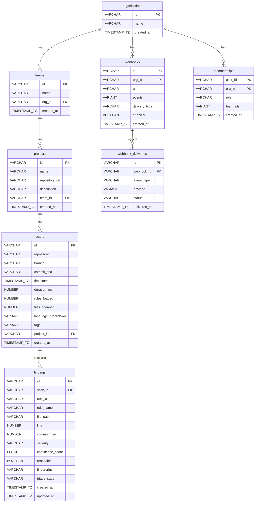

# Snowflake & BI Integration Guide

> Sicario Cloud Platform — Data Export & Analytics Integration
>
> **Requirement 21.28**: Data export in CSV format and via a documented data schema for integration with BI tools (Grafana, Looker, Snowflake).

---

## Table of Contents

1. [Data Schema Reference](#data-schema-reference)
2. [Entity Relationship Diagram](#entity-relationship-diagram)
3. [CSV Export via REST API](#csv-export-via-rest-api)
4. [Convex Data Export](#convex-data-export)
5. [Snowflake Integration](#snowflake-integration)
6. [Grafana & Looker Integration](#grafana--looker-integration)

---

## Data Schema Reference

The Sicario Cloud Platform exposes eight tables. Below are Snowflake-compatible DDL statements for each.

The live schema is always available at `GET /api/v1/export/schema`.

### Type Mapping

| Sicario Type            | Snowflake Type   |
|-------------------------|------------------|
| `string`                | `VARCHAR`        |
| `string (UUID)`         | `VARCHAR(36)`    |
| `string (ISO 8601)`     | `TIMESTAMP_TZ`   |
| `number`                | `NUMBER`         |
| `number (float)`        | `FLOAT`          |
| `boolean`               | `BOOLEAN`        |
| `array<string>`         | `VARIANT`        |
| `object`                | `VARIANT`        |

### Snowflake DDL

```sql
-- ============================================================
-- organizations
-- ============================================================
CREATE TABLE IF NOT EXISTS organizations (
    id              VARCHAR(36)   NOT NULL PRIMARY KEY,
    name            VARCHAR       NOT NULL,
    created_at      TIMESTAMP_TZ  NOT NULL
);

-- ============================================================
-- teams
-- ============================================================
CREATE TABLE IF NOT EXISTS teams (
    id              VARCHAR(36)   NOT NULL PRIMARY KEY,
    name            VARCHAR       NOT NULL,
    org_id          VARCHAR(36)   NOT NULL REFERENCES organizations(id),
    created_at      TIMESTAMP_TZ  NOT NULL
);

-- ============================================================
-- projects
-- ============================================================
CREATE TABLE IF NOT EXISTS projects (
    id              VARCHAR(36)   NOT NULL PRIMARY KEY,
    name            VARCHAR       NOT NULL,
    repository_url  VARCHAR       NOT NULL,
    description     VARCHAR       NOT NULL,
    team_id         VARCHAR(36)   REFERENCES teams(id),
    created_at      TIMESTAMP_TZ  NOT NULL
);

-- ============================================================
-- scans
-- ============================================================
CREATE TABLE IF NOT EXISTS scans (
    id                  VARCHAR(36)   NOT NULL PRIMARY KEY,
    repository          VARCHAR       NOT NULL,
    branch              VARCHAR       NOT NULL,
    commit_sha          VARCHAR       NOT NULL,
    timestamp           TIMESTAMP_TZ  NOT NULL,
    duration_ms         NUMBER        NOT NULL,
    rules_loaded        NUMBER        NOT NULL,
    files_scanned       NUMBER        NOT NULL,
    language_breakdown  VARIANT,
    tags                VARIANT,
    project_id          VARCHAR(36)   REFERENCES projects(id),
    created_at          TIMESTAMP_TZ  NOT NULL
);

-- ============================================================
-- findings
-- ============================================================
CREATE TABLE IF NOT EXISTS findings (
    id                VARCHAR(36)   NOT NULL PRIMARY KEY,
    scan_id           VARCHAR(36)   NOT NULL REFERENCES scans(id),
    rule_id           VARCHAR       NOT NULL,
    rule_name         VARCHAR       NOT NULL,
    file_path         VARCHAR       NOT NULL,
    line              NUMBER        NOT NULL,
    column_num        NUMBER        NOT NULL,
    end_line          NUMBER,
    end_column        NUMBER,
    snippet           VARCHAR       NOT NULL,
    severity          VARCHAR       NOT NULL,
    confidence_score  FLOAT         NOT NULL,
    reachable         BOOLEAN       NOT NULL,
    cloud_exposed     BOOLEAN,
    cwe_id            VARCHAR,
    owasp_category    VARCHAR,
    fingerprint       VARCHAR       NOT NULL,
    triage_state      VARCHAR       NOT NULL,
    triage_note       VARCHAR,
    assigned_to       VARCHAR,
    created_at        TIMESTAMP_TZ  NOT NULL,
    updated_at        TIMESTAMP_TZ  NOT NULL
);

-- ============================================================
-- webhooks
-- ============================================================
CREATE TABLE IF NOT EXISTS webhooks (
    id              VARCHAR(36)   NOT NULL PRIMARY KEY,
    org_id          VARCHAR(36)   NOT NULL REFERENCES organizations(id),
    url             VARCHAR       NOT NULL,
    events          VARIANT       NOT NULL,
    delivery_type   VARCHAR       NOT NULL,
    secret          VARCHAR,
    enabled         BOOLEAN       NOT NULL,
    created_at      TIMESTAMP_TZ  NOT NULL
);

-- ============================================================
-- webhook_deliveries
-- ============================================================
CREATE TABLE IF NOT EXISTS webhook_deliveries (
    id              VARCHAR(36)   NOT NULL PRIMARY KEY,
    webhook_id      VARCHAR(36)   NOT NULL REFERENCES webhooks(id),
    event_type      VARCHAR       NOT NULL,
    payload         VARIANT       NOT NULL,
    status          VARCHAR       NOT NULL,
    response_code   NUMBER,
    delivered_at    TIMESTAMP_TZ  NOT NULL
);

-- ============================================================
-- memberships
-- ============================================================
CREATE TABLE IF NOT EXISTS memberships (
    user_id     VARCHAR       NOT NULL,
    org_id      VARCHAR(36)   NOT NULL REFERENCES organizations(id),
    role        VARCHAR       NOT NULL,
    team_ids    VARIANT       NOT NULL,
    created_at  TIMESTAMP_TZ  NOT NULL,
    PRIMARY KEY (user_id, org_id)
);
```

---

## Entity Relationship Diagram



---

## CSV Export via REST API

### Authentication

All export endpoints require a Bearer JWT token:

```bash
export SICARIO_TOKEN="your-jwt-token"
```

### Export Findings as CSV

```bash
# Export all findings
curl -H "Authorization: Bearer $SICARIO_TOKEN" \
  "https://api.sicario.dev/api/v1/export/findings.csv" \
  -o findings.csv

# Filter by severity
curl -H "Authorization: Bearer $SICARIO_TOKEN" \
  "https://api.sicario.dev/api/v1/export/findings.csv?severity=Critical" \
  -o critical_findings.csv

# Filter by triage state
curl -H "Authorization: Bearer $SICARIO_TOKEN" \
  "https://api.sicario.dev/api/v1/export/findings.csv?triage_state=Open" \
  -o open_findings.csv

# Combine filters
curl -H "Authorization: Bearer $SICARIO_TOKEN" \
  "https://api.sicario.dev/api/v1/export/findings.csv?severity=High&triage_state=Open&project_id=<uuid>" \
  -o filtered.csv
```

### Export Scans as CSV

```bash
# Export all scan history
curl -H "Authorization: Bearer $SICARIO_TOKEN" \
  "https://api.sicario.dev/api/v1/export/scans.csv" \
  -o scans.csv

# Filter by repository
curl -H "Authorization: Bearer $SICARIO_TOKEN" \
  "https://api.sicario.dev/api/v1/export/scans.csv?repository=my-org/my-repo" \
  -o repo_scans.csv
```

### CSV Column Reference

**findings.csv** columns:
`id`, `scan_id`, `rule_id`, `rule_name`, `file_path`, `line`, `column`, `end_line`, `end_column`, `snippet`, `severity`, `confidence_score`, `reachable`, `cloud_exposed`, `cwe_id`, `owasp_category`, `fingerprint`, `triage_state`, `triage_note`, `assigned_to`, `created_at`, `updated_at`

**scans.csv** columns:
`id`, `repository`, `branch`, `commit_sha`, `timestamp`, `duration_ms`, `rules_loaded`, `files_scanned`, `language_breakdown`, `tags`, `findings_count`, `critical_count`, `high_count`

### Scheduled Exports (cron)

Automate periodic CSV exports with cron:

```bash
# /etc/cron.d/sicario-export — daily at 02:00 UTC
0 2 * * * /usr/bin/curl -s -H "Authorization: Bearer $SICARIO_TOKEN" \
  "https://api.sicario.dev/api/v1/export/findings.csv" \
  -o /data/sicario/findings_$(date +\%Y\%m\%d).csv
```

---

## Convex Data Export

Sicario Cloud stores data in [Convex](https://convex.dev). You can export full table snapshots directly.

### Dashboard Export

1. Open the Convex dashboard at `https://dashboard.convex.dev`
2. Select your Sicario deployment
3. Navigate to **Settings → Export Data**
4. Download a ZIP snapshot containing all tables as JSON

### CLI Export

```bash
# Full snapshot export (all tables)
npx convex export --path ./sicario-export

# The export produces one JSON file per table:
# sicario-export/
#   organizations.jsonl
#   teams.jsonl
#   projects.jsonl
#   scans.jsonl
#   findings.jsonl
#   webhooks.jsonl
#   webhookDeliveries.jsonl
#   memberships.jsonl
#   ssoConfigs.jsonl
```

### Convex Query API (Programmatic)

Use the `listForExport` query for filtered findings:

```typescript
import { ConvexHttpClient } from "convex/browser";

const client = new ConvexHttpClient(process.env.CONVEX_URL!);

// All findings
const all = await client.query(api.findings.listForExport, {});

// Filtered
const critical = await client.query(api.findings.listForExport, {
  severity: "Critical",
  triageState: "Open",
});
```

---

## Snowflake Integration

### Option A: CSV File Ingestion (Recommended for periodic loads)

#### 1. Create a Named Stage

```sql
-- Internal stage for Sicario CSV uploads
CREATE OR REPLACE STAGE sicario_stage
  FILE_FORMAT = (
    TYPE = 'CSV'
    FIELD_OPTIONALLY_ENCLOSED_BY = '"'
    SKIP_HEADER = 1
    NULL_IF = ('')
    TIMESTAMP_FORMAT = 'YYYY-MM-DDTHH24:MI:SS.FF3Z'
  );
```

#### 2. Upload CSV Files

```bash
# Upload via SnowSQL
snowsql -q "PUT file://findings.csv @sicario_stage/findings/"
snowsql -q "PUT file://scans.csv @sicario_stage/scans/"
```

#### 3. Load Data with COPY INTO

```sql
-- Load findings
COPY INTO findings
FROM @sicario_stage/findings/
FILE_FORMAT = (
  TYPE = 'CSV'
  FIELD_OPTIONALLY_ENCLOSED_BY = '"'
  SKIP_HEADER = 1
  NULL_IF = ('')
)
ON_ERROR = 'CONTINUE';

-- Load scans
COPY INTO scans
FROM @sicario_stage/scans/
FILE_FORMAT = (
  TYPE = 'CSV'
  FIELD_OPTIONALLY_ENCLOSED_BY = '"'
  SKIP_HEADER = 1
  NULL_IF = ('')
)
ON_ERROR = 'CONTINUE';
```

### Option B: Snowpipe (Automated Continuous Loading)

For real-time ingestion, configure Snowpipe to auto-ingest CSVs from cloud storage.

#### 1. Create an External Stage (S3 example)

```sql
CREATE OR REPLACE STAGE sicario_s3_stage
  URL = 's3://your-bucket/sicario-exports/'
  CREDENTIALS = (AWS_KEY_ID = '...' AWS_SECRET_KEY = '...')
  FILE_FORMAT = (
    TYPE = 'CSV'
    FIELD_OPTIONALLY_ENCLOSED_BY = '"'
    SKIP_HEADER = 1
    NULL_IF = ('')
  );
```

#### 2. Create the Pipe

```sql
CREATE OR REPLACE PIPE sicario_findings_pipe
  AUTO_INGEST = TRUE
AS
  COPY INTO findings
  FROM @sicario_s3_stage/findings/
  FILE_FORMAT = (
    TYPE = 'CSV'
    FIELD_OPTIONALLY_ENCLOSED_BY = '"'
    SKIP_HEADER = 1
    NULL_IF = ('')
  );
```

#### 3. Configure S3 Event Notifications

Point your S3 bucket's event notifications to the Snowpipe SQS queue ARN (shown in `SHOW PIPES`).

### Option C: Convex JSON Export → Snowflake

Load Convex JSONL exports using Snowflake's JSON support:

```sql
-- Create a JSON file format
CREATE OR REPLACE FILE FORMAT sicario_jsonl
  TYPE = 'JSON'
  STRIP_OUTER_ARRAY = FALSE;

-- Stage and load
PUT file://findings.jsonl @sicario_stage/json/;

-- Load into a raw VARIANT column, then flatten
CREATE OR REPLACE TABLE findings_raw (data VARIANT);

COPY INTO findings_raw
FROM @sicario_stage/json/findings.jsonl
FILE_FORMAT = sicario_jsonl;

-- Flatten into the typed table
INSERT INTO findings
SELECT
    data:findingId::VARCHAR       AS id,
    data:scanId::VARCHAR          AS scan_id,
    data:ruleId::VARCHAR          AS rule_id,
    data:ruleName::VARCHAR        AS rule_name,
    data:filePath::VARCHAR        AS file_path,
    data:line::NUMBER             AS line,
    data:column::NUMBER           AS column_num,
    data:endLine::NUMBER          AS end_line,
    data:endColumn::NUMBER        AS end_column,
    data:snippet::VARCHAR         AS snippet,
    data:severity::VARCHAR        AS severity,
    data:confidenceScore::FLOAT   AS confidence_score,
    data:reachable::BOOLEAN       AS reachable,
    data:cloudExposed::BOOLEAN    AS cloud_exposed,
    data:cweId::VARCHAR           AS cwe_id,
    data:owaspCategory::VARCHAR   AS owasp_category,
    data:fingerprint::VARCHAR     AS fingerprint,
    data:triageState::VARCHAR     AS triage_state,
    data:triageNote::VARCHAR      AS triage_note,
    data:assignedTo::VARCHAR      AS assigned_to,
    data:createdAt::TIMESTAMP_TZ  AS created_at,
    data:updatedAt::TIMESTAMP_TZ  AS updated_at
FROM findings_raw;
```

### Example Analytics Queries

```sql
-- Mean Time to Resolve (MTTR) by severity
SELECT
    severity,
    AVG(DATEDIFF('hour', created_at, updated_at)) AS avg_mttr_hours,
    COUNT(*)                                       AS resolved_count
FROM findings
WHERE triage_state = 'Fixed'
GROUP BY severity
ORDER BY avg_mttr_hours DESC;

-- Severity trend over time (weekly)
SELECT
    DATE_TRUNC('week', created_at) AS week,
    severity,
    COUNT(*)                       AS finding_count
FROM findings
GROUP BY week, severity
ORDER BY week DESC, finding_count DESC;

-- Triage velocity — findings resolved per week
SELECT
    DATE_TRUNC('week', updated_at) AS week,
    COUNT(*)                       AS resolved
FROM findings
WHERE triage_state = 'Fixed'
GROUP BY week
ORDER BY week DESC;

-- Open critical/high findings by repository
SELECT
    s.repository,
    f.severity,
    COUNT(*) AS open_count
FROM findings f
JOIN scans s ON f.scan_id = s.id
WHERE f.triage_state IN ('Open', 'Reviewing', 'ToFix')
  AND f.severity IN ('Critical', 'High')
GROUP BY s.repository, f.severity
ORDER BY open_count DESC;

-- Scan performance over time
SELECT
    DATE_TRUNC('day', timestamp) AS day,
    COUNT(*)                     AS scan_count,
    AVG(duration_ms)             AS avg_duration_ms,
    SUM(files_scanned)           AS total_files
FROM scans
GROUP BY day
ORDER BY day DESC;
```

---

## Grafana & Looker Integration

### Grafana

**Option 1 — Snowflake data source** (recommended for production):
1. Install the [Snowflake Grafana plugin](https://grafana.com/grafana/plugins/grafana-snowflake-datasource/)
2. Configure with your Snowflake account, warehouse, database, and schema
3. Use the analytics queries above as panel data sources

**Option 2 — JSON API data source** (lightweight, no Snowflake required):
1. Install the [JSON API data source plugin](https://grafana.com/grafana/plugins/marcusolsson-json-datasource/)
2. Point it at `https://api.sicario.dev/api/v1`
3. Configure endpoints:
   - `/analytics/overview` → stat panels (total findings, MTTR)
   - `/analytics/trends` → time-series graphs
   - `/analytics/mttr` → gauge panels
   - `/findings?severity=Critical` → table panels

### Looker

**Option 1 — Snowflake connection**:
1. In Looker Admin → Database → Connections, add a Snowflake connection
2. Point to the database/schema containing the Sicario tables
3. Use LookML to model the tables (the DDL above maps directly to LookML dimensions)

**Option 2 — REST API via Looker Actions**:
1. Configure a Looker Action Hub endpoint pointing to the Sicario API
2. Use the `/export/findings.csv` endpoint for scheduled data pulls

---

## Schema Endpoint

The live schema is always available programmatically:

```bash
curl -H "Authorization: Bearer $SICARIO_TOKEN" \
  "https://api.sicario.dev/api/v1/export/schema" | jq .
```

This returns a JSON object describing all tables, column names, types, and descriptions — useful for auto-generating Snowflake DDL or LookML models.
